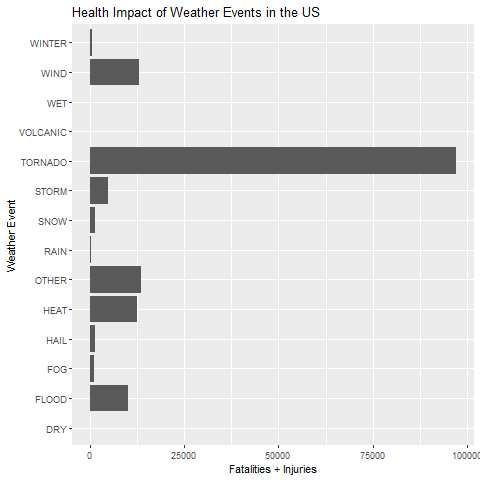
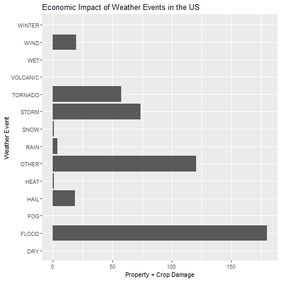

## Synopsis

Storms and other severe weather events can cause both public health and economic problems for communities and municipalities. Many severe events can result in fatalities, injuries, and property damage, and preventing such outcomes to the extent possible is a key concern.

This project involves exploring the U.S. National Oceanic and Atmospheric Administration's (NOAA) storm database. This database tracks characteristics of major storms and weather events in the United States, including when and where they occur, as well as estimates of any fatalities, injuries, and property damage.


## Data Processing

Load the packages used in this analysis
```{r}
library(ggplot2)
library(dplyr)
```
Load the data 
```{r}
data <- read.csv("repdata_data_StormData.csv.bz2")
```
View a summary of the data
```{r}
summary(data)
```

This dataset is very large and is computationally expensive to process. Here we extract only the variables of interest, namely:

* FATALITIES
* INJURIES
* EVTYPE: event type (e.g. wind, snow, flood, etc.)
* PROPDMG: Represents the mantissa of the value of property damage
* PROPDMGEXP: Represents the exponent of the value of property damage
* CROPDMG: Mantissa of the value of crop damage
* CROPDMGEXP: Exponent of the value of crop damage

```{r}
variables <- c("EVTYPE", "FATALITIES", "INJURIES", "PROPDMG", "PROPDMGEXP", "CROPDMG", "CROPDMGEXP")
data <- data[, variables]
```

Now that we have the variables of needed for the analysis, we need to clean them up by grouping similar EVTYPE values (e.g. flash floods and floods should be grouped together).
```{r}
data$group <- "OTHER"
data$group[grep("WET", data$EVTYPE, ignore.case=TRUE)] <- "WET"
data$group[grep("WINTER", data$EVTYPE, ignore.case=TRUE)] <- "WINTER"
data$group[grep("VOLCANIC", data$EVTYPE, ignore.case=TRUE)] <- "VOLCANIC"
data$group[grep("FOG", data$EVTYPE, ignore.case=TRUE)] <- "FOG"
data$group[grep("DRY", data$EVTYPE, ignore.case=TRUE)] <- "DRY"
data$group[grep("HAIL", data$EVTYPE, ignore.case=TRUE)] <- "HAIL"
data$group[grep("HEAT", data$EVTYPE, ignore.case=TRUE)] <- "HEAT"
data$group[grep("FLOOD", data$EVTYPE, ignore.case=TRUE)] <- "FLOOD"
data$group[grep("STORM", data$EVTYPE, ignore.case=TRUE)] <- "STORM"
data$group[grep("RAIN", data$EVTYPE, ignore.case=TRUE)] <- "RAIN"
data$group[grep("SNOW", data$EVTYPE, ignore.case=TRUE)] <- "SNOW"
data$group[grep("TORNADO", data$EVTYPE, ignore.case=TRUE)] <- "TORNADO"
data$group[grep("WIND", data$EVTYPE, ignore.case=TRUE)] <- "WIND"
sort(table(data$group), decreasing=TRUE)
```

The exponents of Property and Crop Damage (PROPDMGEXP and CROPDMGEXP) are represented by the letters K, M, and B which correspond to 3, 6, and 9 respectively. In order to calculate values, we need to transform the data into numbers. Anything that is not K, M, or B will be set to 0.
```{r}
data$PROPDMGEXP[!grepl("K|M|B", data$PROPDMGEXP, ignore.case=TRUE)] <- 0
data$PROPDMGEXP[grep("K", data$PROPDMGEXP, ignore.case=TRUE)] <- 3
data$PROPDMGEXP[grep("M", data$PROPDMGEXP, ignore.case=TRUE)] <- 6
data$PROPDMGEXP[grep("B", data$PROPDMGEXP, ignore.case=TRUE)] <- 9
data$CROPDMGEXP[!grepl("K|M|B", data$CROPDMGEXP, ignore.case=TRUE)] <- 0
data$CROPDMGEXP[grep("K", data$CROPDMGEXP, ignore.case=TRUE)] <- 3
data$CROPDMGEXP[grep("M", data$CROPDMGEXP, ignore.case=TRUE)] <- 6
data$CROPDMGEXP[grep("B", data$CROPDMGEXP, ignore.case=TRUE)] <- 9
```

Using these values we will calculate the Property and Crop Damage
```{r}
data$prop <- with(data, as.numeric(PROPDMG) * 10^as.numeric(PROPDMGEXP)) / 10^9
data$crop <- with(data, as.numeric(CROPDMG) * 10^as.numeric(CROPDMGEXP)) / 10^9
```

Now that our data is cleaned up, we will summarize the health impacts by aggregating the resulting number of fatalities and injuries per event. 
```{r}
health_impact <- aggregate(x=list(impact = data$FATALITIES + data$INJURIES), by=list(event = data$group), FUN=sum, na.rm=TRUE)
```
We also summarize the economic impacts by aggregating property and crop damage per event.
```{r}
economic_impact <- aggregate(x=list(impact = data$prop + data$crop), by=list(event = data$group), FUN=sum, na.rm=TRUE)
```


## Results

Using the organized data we can show the most statistically harmful weather events in the US. 
```{r}
health_impact.plot <- ggplot(health_impact, aes(x=impact, y=event)) +
  geom_bar(stat="identity") + 
  labs(title="Health Impact of Weather Events in the US", y="Weather Event", x="Fatalities + Injuries")

```
<!-- -->

We can also show the approximate property and cost damage resulting from these weather events. 

```{r}
economic_impact.plot <- ggplot(economic_impact, aes(x=impact, y=event)) +
    geom_bar(stat="identity") + 
    labs(title="Economic Impact of Weather Events in the US", y="Weather Event", x="Property + Crop Damage")
```
<!-- -->

